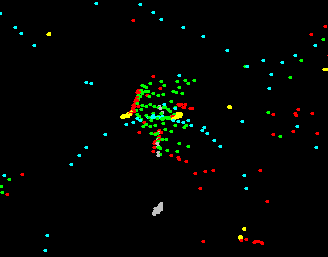
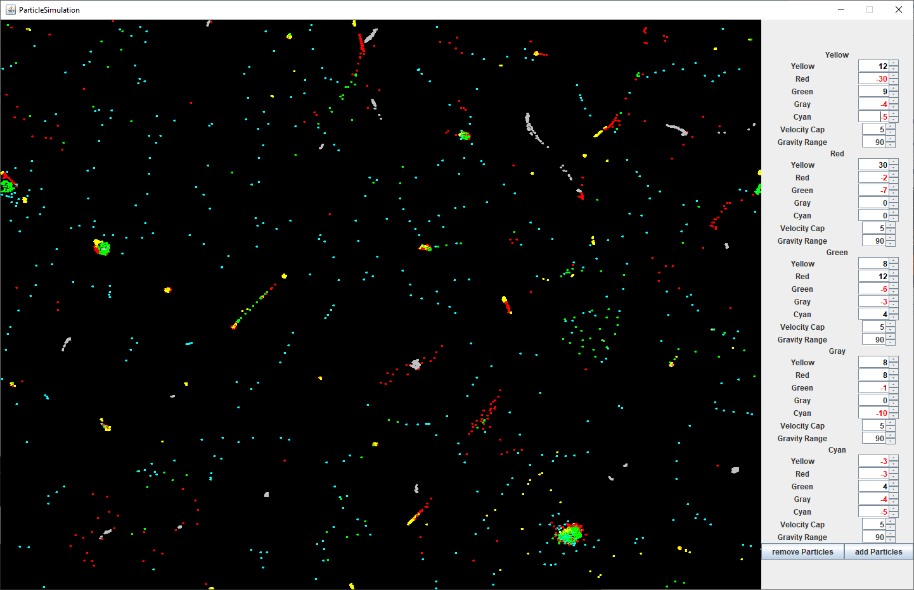
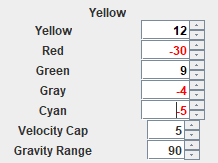

 
example of some particles floating around

# Particle Simulation

------------------

 
There are five different particle types represented by the colors yellow, red, green, gray and cyan. Each particle type has a range in which it can have a pushing or pulling effect on a other type of particle. If a particle leaves one side, it appears on the other. Over time, particles lose velocity to simulate friction. One pixel can only hold one particle. 
 
 

## Interface explained

------------------

 
Yellow is pulled to yellow (+12) and green (+9) particles, pushed away by red (-30), gray (-4) and cyan (-5). Per update it is able to travel a maximum of 5 pixels (veloctiy cap) and its gravity affects other particles in a range of 90 pixels (gravity range). A "velocity cap" of "-1" means there is no cap. 
The "add particles" button adds 50 particles of each color, the "remove particles" button removes 50 particles of each color.
 
 

### You need at least Java SE 15 to run the jar

------------------

You can get the newest version here: https://www.oracle.com/java/technologies/downloads/